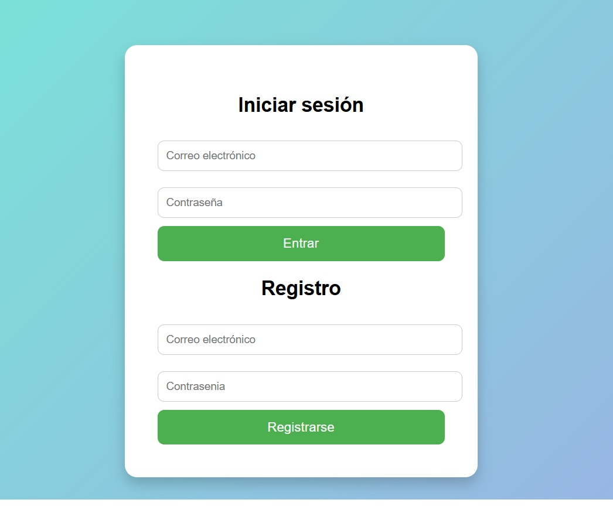
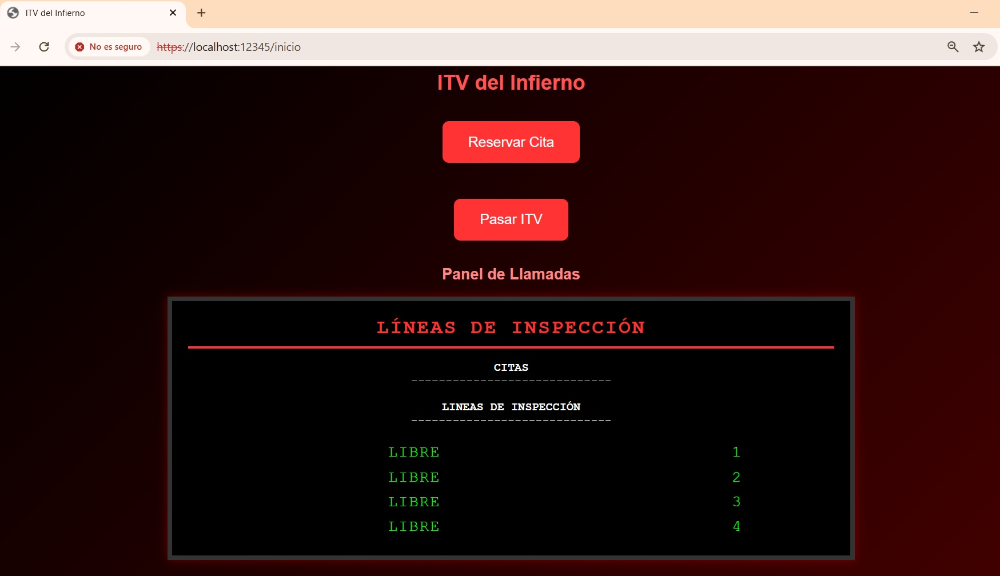
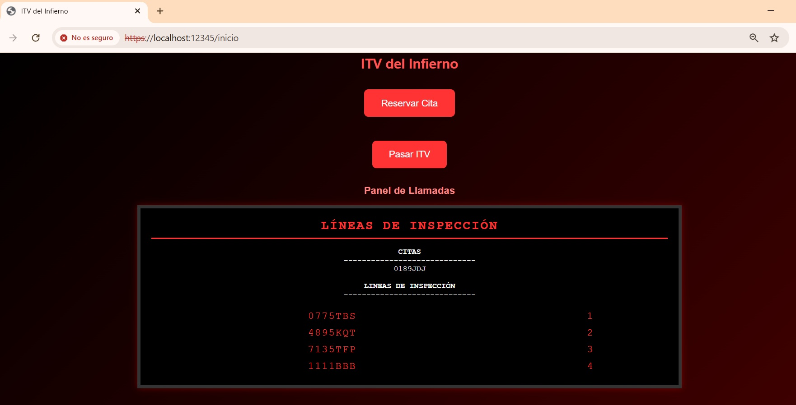
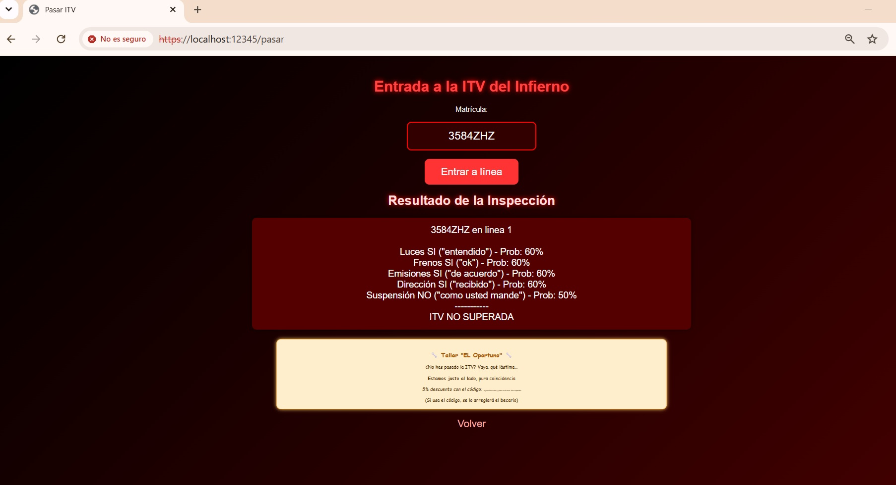
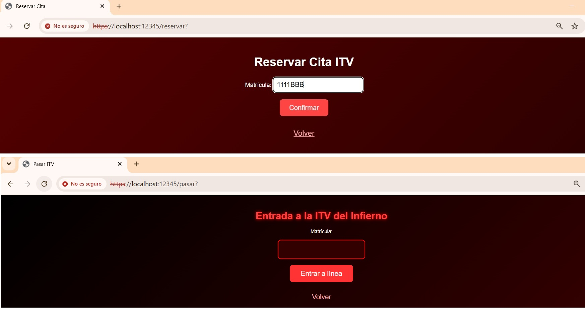

# Servidor-ITV-Seguro

Servidor HTTP seguro que simula una estacion de Inspeccion Tecnica de Vehiculos (ITV). Implementa comunicacion cifrada mediante SSL/TLS, autenticacion de usuarios con BCrypt y almacenamiento seguro de credenciales con AES. El servidor permite a los usuarios registrarse, iniciar sesion, reservar citas para la ITV y pasar la inspeccion de su vehiculo.

> Desarrollado en Java como tarea de la asignatura "Programacion de Servicios y Procesos" (PSP) del grado de Programacion Multimedia y Dispositivos Moviles.

---

## Capturas de pantalla

|                                |                                    |
|:------------------------------:|:----------------------------------:|
|  |  |

|                                      |                                    |
|:------------------------------------:|:----------------------------------:|
|  |  |

|                                      | 
|:------------------------------------:|
|  |

---

## Caracteristicas principales

### Seguridad
- Comunicacion cifrada con SSL/TLS (HTTPS) mediante certificado autofirmado
- Contrasenas protegidas con BCrypt (hash salado con factor de coste 12)
- Fichero de usuarios cifrado con AES-128
- Logs de eventos y errores del servidor

### Autenticacion de Usuarios
- Registro de nuevos usuarios con validacion de email (regex)
- Inicio de sesion con email y contrasena
- Validacion de contrasena (minimo 6 caracteres, letras y numeros)
- Control de acceso concurrente al fichero de usuarios (patron Lectores-Escritores)

### Gestion de ITV
- Visualizacion de citas pendientes en panel interactivo
- Asignacion de lineas de inspeccion (4 lineas disponibles)
- Simulacion de 5 pruebas: Luces, Frenos, Emisiones, Direccion, Suspension
- Resultados basados en respuestas del "cliente" (frases de cuñado vs normales)
- Tiempo de espera realista entre pruebas (1-10 segundos)
- Panel de estado con lineas verdes (libres) y rojas (ocupadas)

### Concurrencia y Rendimiento
- Multiples clientes atendidos en hilos independientes (Thread per Request)
- Control de acceso a recursos compartidos con synchronized
- Patron Lectores-Escritores para el fichero de usuarios
- Sincronizacion con wait() y notifyAll()
- Almacenamiento en memoria con ConcurrentHashMap (thread-safe)

---

## Tecnologias utilizadas

- Java 8 - Lenguaje de programacion
- SSL/TLS - Comunicacion segura cliente-servidor
- BCrypt - Cifrado de contrasenas (hash salado)
- AES-128 - Cifrado del fichero de usuarios
- ConcurrentHashMap - Almacenamiento en memoria thread-safe
- Logging (java.util.logging) - Registro de eventos y errores
- Sockets SSL - Comunicacion en red segura
- Keytool - Generacion de certificados SSL

---

## Que he aprendido?
- Configurar SSL/TLS en un servidor Java con certificados autofirmados
- Implementar cifrado de contrasenas con BCrypt
- Gestionar la concurrencia con hilos y sincronizacion
- Implementar el patron Lectores-Escritores para control de acceso
- Crear un servidor HTTP desde cero con Sockets
- Manejar peticiones GET y POST
- Generar respuestas HTTP dinamicas con HTML
- Gestionar recursos compartidos 
- Manejar interrupciones de hilos con wait() y notifyAll()
- Validar emails con expresiones regulares
- Generar HTML dinamico desde Java
- Manejar excepciones y errores de red
- Implementar un sistema de autenticacion completo (Con los Requisitos de la Tarea)

---

## Requisitos previos

1. **JDK 8 o superior** instalado
2. **Keytool** (incluido con el JDK) para generar el certificado SSL
3. Puerto **12345** disponible en el sistema

---

## Instalacion y Configuracion

### 1. Generar el Certificado SSL

1. Generar el certificado SSL con keytool:
2. Compilar el proyecto:
3. Ejecutar el servidor:
4. Acceder al servidor desde el navegador:
  

## Autor

**Abraham C**  
[GitHub](https://github.com/acdezindev) | [LinkedIn](https://www.linkedin.com/in/AbrahamCdev)

---

## Estado de la tarea de formacion academica

